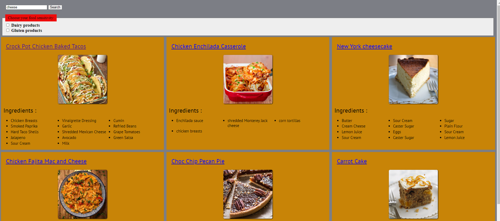
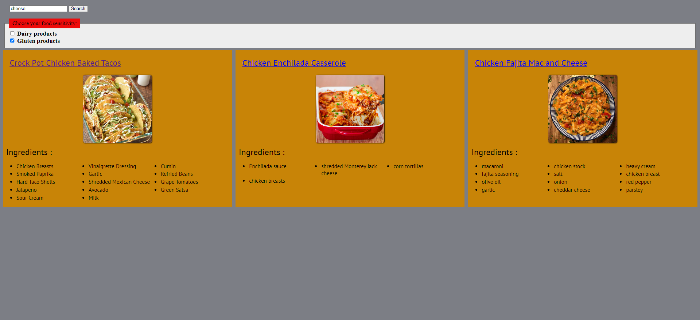

# My recipes project
a server that takes recipes with specific ingredient from user input and shows them in site , can also filer by food senstivity

## Table Of Contents
  
  * [Screenshots](#screenshots)
    + [Get recipes by ingredient](#Get-recipes-by-ingredient)
    + [Filter by food senstivity](#Filter-by-food-senstivity)
  * [Tech Stack](#tech-stack)

## Screenshots

### Get recipes by ingredient
Fill out the text input and get recipes by ingredient

### Filter by food senstivity
Click the checkboxes and filter by food senstivity

## Techstack
1. html , js , css.
2. Express (Node.js).